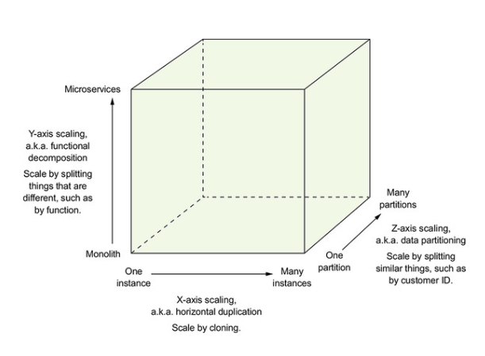

# Architecture

## CPU 연산의 작업을 Nodejs에서 실행하기 위해선?
- 안티리빙 패턴
- 멀티 프로세스
- better solution?

## Scalability (with multi process)
- Load Distribution (부하 분산)

## Scale Cube (부하분산)

- x축 : 복제
- y축 : 서비스 / 기능별 분해 -> MicroService
- z축 : 데이터 파티션 분할 -> Sharding