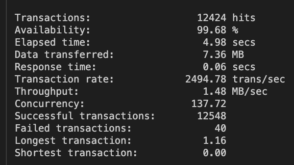
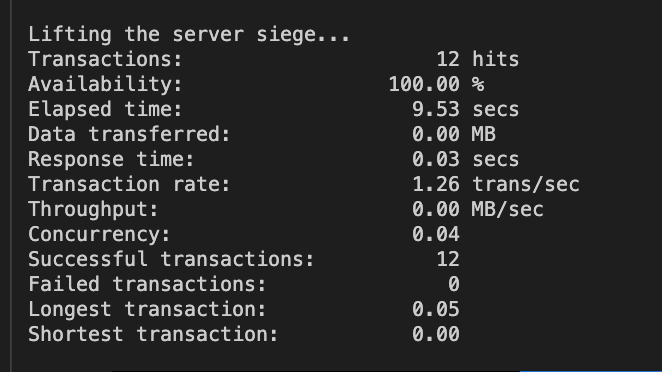

# Architecture

## CPU 연산의 작업을 Nodejs에서 실행하기 위해선?
- 안티리빙 패턴
- 멀티 프로세스
- better solution?

## Scalability (with multi process)
- Load Distribution (부하 분산)

## Scale Cube (부하분산)

- x축 : 복제
- y축 : 서비스 / 기능별 분해 -> MicroService
- z축 : 데이터 파티션 분할 -> Sharding

## Cluster
- Nodejs는 기본적인 싱글 스레드 형식이기 때문에 Load Balancing시 Cluster 모듈을 사용하여 부하분산을 줄여야한다

### 네트워크 벤치마킹 도구 (Siege)
- https://jasonmccreary.me/articles/installing-siege-mac-os-x-lion/

### Single Thread

- 한개의 스레드로 실행을 하다보니 많은 부하를 받는다

### Nodejs Multi Process (with cluster module)

- 총 12개 process로 나눠서 부하를 나눠받는다 (cpu수는 컴퓨터사양에 따라 상이함)